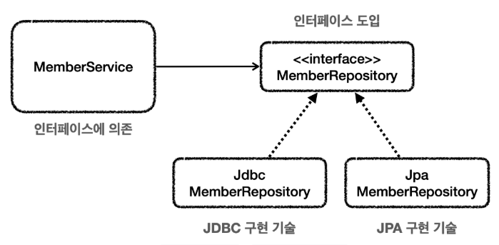

# 체크 예외와 인터페이스
서비스 계층은 가급적 특정 구현 기술에 의존하지 않고, 순수하게 유지하는 것이 좋다. 이렇게 하려면 예외에 대한 의존
도 함께 해결해야한다.
예를 들어서 서비스가 처리할 수 없는 SQLException 에 대한 의존을 제거하려면 어떻게 해야할까?
서비스가 처리할 수 없으므로 리포지토리가 던지는 SQLException 체크 예외를 런타임 예외로 전환해서 서비스 계
층에 던지자. 이렇게 하면 서비스 계층이 해당 예외를 무시할 수 있기 때문에, 특정 구현 기술에 의존하는 부분을 제거하
고 서비스 계층을 순수하게 유지할 수 있다.
지금부터 코드로 이 방법을 적용해보자.

## 인터페이스 도입

* 이렇게 인터페이스를 도입하면 ```MemberService``` 는 ```MemberRepository``` 인터페이스에만 의존하면 된다.
* 이제 구현 기술을 변경하고 싶으면 DI를 사용해서 ```MemberService``` 코드의 변경 없이 구현 기술을 변경할 수 있다.

<br>

### MemberRepository 인터페이스
```java
package thespeace.jdbc.repository;
import thespeace.jdbc.domain.Member;

public interface MemberRepository {
    Member save(Member member);
    Member findById(String memberId);
    void update(String memberId, int money);
    void delete(String memberId);
}
```
특정 기술에 종속되지 않는 순수한 인터페이스이다. 이 인터페이스를 기반으로 특정 기술을 사용하는 구현체를 만들면 된다.

<br>

### 체크 예외와 인터페이스
기존에는 왜 이런 인터페이스를 만들지 않았을까? 사실 다음과 같은 문제가 있기 때문에 만들지 않았다.<br>
왜냐하면 ```SQLException``` 이 체크 예외이기 때문이다. 여기서 체크 예외가 또 발목을 잡는다.<br>
체크 예외를 사용하려면 인터페이스에도 해당 체크 예외가 선언 되어 있어야 한다.<br>
예를 들면 다음과 같은 코드가 된다.

<br>

### 체크 예외 코드에 인터페이스 도입시 문제점 - 인터페이스
```java
package thespeace.jdbc.repository;
import thespeace.jdbc.domain.Member;
import java.sql.SQLException;

public interface MemberRepositoryEx {
    Member save(Member member) throws SQLException;
    Member findById(String memberId) throws SQLException;
    void update(String memberId, int money) throws SQLException;
    void delete(String memberId) throws SQLException;
}
```
* 인터페이스의 메서드에 ```throws SQLException``` 이 있는 것을 확인할 수 있다.

<br>

### 체크 예외 코드에 인터페이스 도입시 문제점 - 구현 클래스
```java
@Slf4j
public class MemberRepositoryV3 implements MemberRepositoryEx {
    public Member save(Member member) throws SQLException {
        String sql = "insert into member(member_id, money) values(?, ?)";
    }
}
```
* 인터페이스의 구현체가 체크 예외를 던지려면, 인터페이스 메서드에 먼저 체크 예외를 던지는 부분이 선언 되어있어야 한다. 그래야 구현 클래스의 메서드도 체크 예외를 던질 수 있다.
  * 쉽게 이야기 해서 ```MemberRepositoryV3``` 가 ```throws SQLException``` 를 하려면 ```MemberRepositoryEx``` 인터페이스에도 ```throws SQLException``` 이 필요하다.
* 참고로 구현 클래스의 메서드에 선언할 수 있는 예외는 부모 타입에서 던진 예외와 같거나 하위 타입이어야 한다.
  * 예를 들어서 인터페이스 메서드에 ```throws Exception``` 를 선언하면, 구현 클래스 메서드에 ```throws SQLException``` 는 가능하다. ```SQLException``` 은 ```Exception``` 의 하위 타입이기 때문이다.

<br>

### 특정 기술에 종속되는 인터페이스
구현 기술을 쉽게 변경하기 위해서 인터페이스를 도입하더라도 ```SQLException``` 과 같은 특정 구현 기술에 종속적인 체크 예외를 사용하게 되면 인터페이스에도 해당 예외를 포함해야 한다.
하지만 이것은 우리가 원하던 순수한 인터페이스가 아니다. JDBC 기술에 종속적인 인터페이스일 뿐이다. 인터페이스를 만드는 목적은 구현체를 쉽게 변경하기 위함인데, 이미 인터페이스가
특정 구현 기술에 오염이 되어 버렸다. 향후 JDBC가 아닌 다른 기술로 변경한다면 인터페이스 자체를 변경해야 한다.

<br>

### 런타임 예외와 인터페이스
런타임 예외는 이런 부분에서 자유롭다. 인터페이스에 런타임 예외를 따로 선언하지 않아도 된다. 따라서 인터페이스가 특정 기술에 종속적일 필요가 없다.