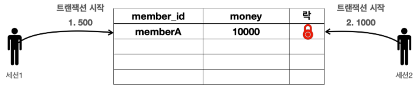
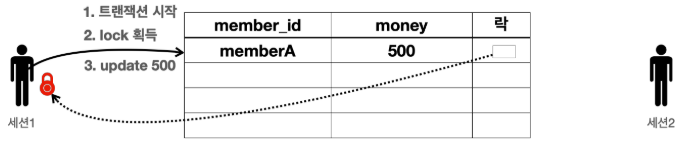
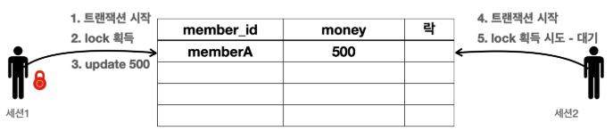
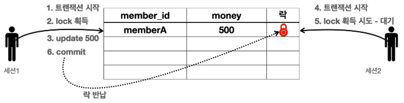
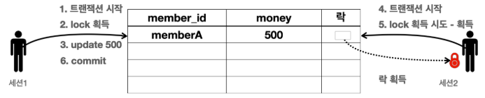
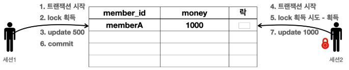
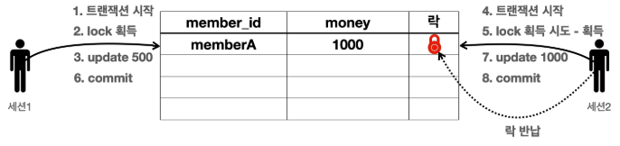

# DB 락 - 개념 이해
세션1이 트랜잭션을 시작하고 데이터를 수정하는 동안 아직 커밋을 수행하지 않았는데, 세션2에서 동시에 같은 데이터를
수정하게 되면 여러가지 문제가 발생한다. 바로 트랜잭션의 원자성이 깨지는 것이다. 여기에 더해서 세션1이 중간에
롤백을 하게 되면 세션2는 잘못된 데이터를 수정하는 문제가 발생한다.

이런 문제를 방지하려면, 세션이 트랜잭션을 시작하고 데이터를 수정하는 동안에는 커밋이나 롤백 전까지 다른 세션에서 해당 데이터를 수정할 수 없게 막아야 한다.

1. 
   * 세션1은 memberA 의 금액을 500원으로 변경하고 싶고, 세션2는 같은 memberA 의 금액을 1000원으로 변경하고 싶다.
   * 데이터베이스는 이런 문제를 해결하기 위해 락(Lock)이라는 개념을 제공한다.
   * 다음 예시를 통해 동시에 데이터를 수정하는 문제를 락으로 어떻게 해결하는지 자세히 알아보자.

 

2. 
   1. 세션1은 트랜잭션을 시작한다.
   2. 세션1은 memberA 의 money 를 500으로 변경을 시도한다. 이때 해당 로우의 락을 먼저 획득해야 한다. 락이 남아 있으므로 세션1은 락을 획득한다. (세션1이 세션2보다 조금 더 빨리 요청했다.)
   3. 세션1은 락을 획득했으므로 해당 로우에 update sql을 수행한다.

 

3. 
   4. 세션2는 트랜잭션을 시작한다.
   5. 세션2도 memberA 의 money 데이터를 변경하려고 시도한다. 이때 해당 로우의 락을 먼저 획득해야 한다. 락이 없으므로 락이 돌아올 때 까지 대기한다.
   * 참고로 세션2가 락을 무한정 대기하는 것은 아니다. 락 대기 시간을 넘어가면 락 타임아웃 오류가 발생한다. 락 대기 시간은 설정할 수 있다.

 

4. 
   6. 세션1은 커밋을 수행한다. 커밋으로 트랜잭션이 종료되었으므로 락도 반납한다.

 

5. 
   * 락을 획득하기 위해 대기하던 세션2가 락을 획득한다.

 

6. 
   7. 세션2는 update sql을 수행한다.

 

7. 
   8. 세션2는 커밋을 수행하고 트랜잭션이 종료되었으므로 락을 반납한다.