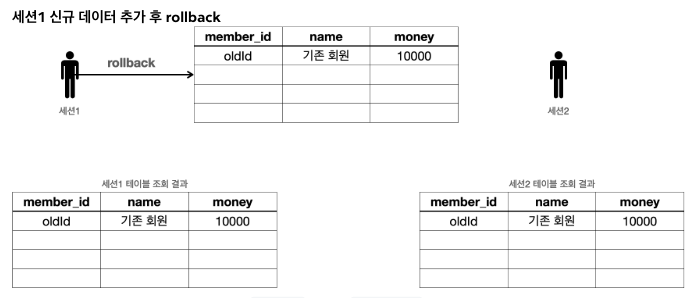

# 트랜잭션 - DB 예제 1 - 개념 이해
트랜잭션 동작을 예제를 통해 확인해보자. 먼저 트랜잭션의 동작 개념의 전체 그림을 이해하는데 집중하자.

지금부터 설명하는 내용은 트랜잭션 개념의 이해를 돕기 위해 예시로 설명하는 것이다. 구체적인 실제 구현 방식은 데이터베이스 마다 다르다.

<br>

### 트랜잭션 사용법
* 데이터 변경 쿼리를 실행하고 데이터베이스에 그 결과를 반영하려면 커밋 명령어인 ```commit```을 호출하고, 결과를 반영하고 싶지 않으면 롤백 명령어인 ```rollback```을 호출하면 된다.
* 커밋을 호출하기 전까지는 임시로 데이터를 저장하는 것이다. 따라서 해당 트랜잭션을 시작한 세션(사용자)에게만 변경 데이터가 보이고 다른 세션(사용자)에게는 변경 데이터가 보이지 않는다.
* 등록, 수정, 삭제 모두 같은 원리로 동작한다. 앞으로는 등록, 수정, 삭제를 간단히 변경이라는 단어로 표현하겠다.

<br>

### 기본 데이터
* 
* 세션 1, 세션 2 둘 다 가운데 있는 기본 테이블을 조회하면 해당 데이터가 그대로 조회된다.

<br>

### 세션 1, 신규 데이터 추가
* 
* 세션 1은 트랜잭션을 시작하고 신규 회원1, 신규 회원 2를 DB에 추가했다. 아직 커밋은 하지 않은 상태이다.
* 새로운 데이터는 임시 상태로 저장된다.
* 세션 1은 ```select``` 쿼리를 실행해서 본인이 입력한 신규 회원1, 신규 회원2를 조회할 수 있다.
* 세션 2는 ```select``` 쿼리를 실행해도 신규 회원들을 조회할 수 없다. 왜냐하면 세션 1이 아직 커밋을 하지 않았기 때문이다.

<br>

### 커밋하지 않은 데이터를 다른 곳에서 조회할 수 있으면 어떤 문제가 발생할까?
* 예를 들어서 커밋하지 않는 데이터가 보인다면, 세션 2는 데이터를 조회했을 때 신규 회원 1,2가 보일 것이다. 따라서 신규 회원 1, 신규 회원 2가 있다고 가정하고 어떤 로직을 수행할 수 있다. 그런데 세션1이 롤백을 수행하면 신규 회원1, 신규 회원2의 데이터가 사라지게 된다. 따라서 데이터 정합성에 큰 문제가 발생한다.
* 세션 2에서 세션 1이 아직 커밋하지 않은 변경 데이터가 보인다면, 세션 1이 롤백 했을 때 심각한 문제가 발생할 수 있다. 따라서 커밋 전의 데이터는 다른 세션에서 보이지 않는다.

<br>

### 세션 1, 신규 데이터 추가 후 ```commit```
* 
* 세션 1이 신규 데이터를 추가한 후에 ```commit```을 호출했다.
* ```commit```으로 새로운 데이터가 실제 데이터베이스에 반영된다. 데이터의 상태도 임시 -> 완료로 변경되었다.
* 이제 다른 세션에서도 회원 테이블을 조회하면 신규 회원들을 확인할 수 있다.

<br>

### 세션 1, 신규 데이터 추가 후 ```rollback```
* 
* 세션 1이 신규 데이터를 추가한 후에 ```commit```대신에 ```rollback```을 호출했다.
* 세션 1이 데이터베이스에 반영한 모든 데이터가 처음 상태로 복구된다.
* 수정하거나 삭제한 데이터도 ```rollback```을 호출하면 모두 트랜잭션을 시작하기 직전의 상태로 복구된다.