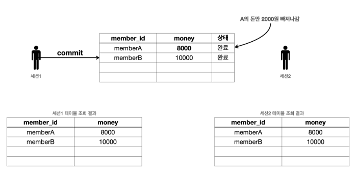

# 트랜잭션 - DB 예제4 - 계좌이체
이번에는 계좌이체 예제를 통해 트랜잭션이 어떻게 사용되는지 조금 더 자세히 알아보자.

다음 3가지 상황을 준비했다.
* 계좌이체 정상
* 계좌이체 문제 상황 - 커밋
* 계좌이체 문제 상황 - 롤백

<br>

### 계좌이체 정상
계좌이체가 발생하는 정상 흐름을 알아보자.
* 기본 데이터 입력
  * ```sql
    set autocommit true;
    delete from member;
    insert into member(member_id, money) values ('memberA',10000);
    insert into member(member_id, money) values ('memberB',10000);
    ```
    
* 계좌이체 실행
  * memberA 의 돈을 memberB 에게 2000원 계좌이체하는 트랜잭션을 실행해보자. 다음과 같은 2번의 ```update``` 쿼리가 수행되어야 한다.
  * ```sql
    #계좌이체 실행 sql - 성공
    set autocommit false;
    update member set money=10000 - 2000 where member_id = 'memberA';
    update member set money=10000 + 2000 where member_id = 'memberB';
    ```
  * 아직 커밋하지 않았으므로 다른 세션에는 기존 데이터가 조회된다.
  * ```commit```명령어를 실행하면 데이터베이스에 결과가 반영된다.
  * 다른 세션에서도 memberA 의 금액이 8000원으로 줄어들고, memberB 의 금액이 12000원으로 증가한 것을 확인할 수 있다.(```select * from member;```)


* 계좌이체 문제 상황 - 커밋
  * 이번에는 계좌이체 도중에 문제가 발생하는 상황을 알아보자.
  * ```sql
    #예제를 위해 데이터 초기화
    set autocommit true;
    delete from member;
    insert into member(member_id, money) values ('memberA',10000);
    insert into member(member_id, money) values ('memberB',10000);
    
    #계좌이체 실행 sql - 오류
    set autocommit false;
    update member set money=10000 - 2000 where member_id = 'memberA'; #성공
    update member set money=10000 + 2000 where member_iddd = 'memberB'; #쿼리 예외 발생
    ```
  * 계좌이체를 실행하는 도중에 SQL에 문제가 발생한다. 그래서 memberA 의 돈을 2000원 줄이는 것에는 성공했지만, memberB 의 돈을 2000원 증가시키는 것에 실패한다.
  * 여기서 문제는 memberA 의 돈은 2000원 줄어들었지만, memberB 의 돈은 2000원 증가하지 않았다는 점이다. 결과적으로 계좌이체는 실패하고 memberA 의 돈만 2000원 줄어든 상황이다.
  * 
  * 만약 이 상황에서 강제로 ```commit```을 호출하면 어떻게 될까? 계좌이체는 실패하고 memberA의 돈만 2000원 줄어드는 아주 심각한 문제가 발생한다.
  * 이렇게 중간에 문제가 발생했을 때는 커밋을 호출하면 안된다. 롤백을 호출해서 데이터를 트랜잭션 시작 시점으로 원복해야 한다.

    
* 계좌이체 문제 상황 - 롤백
  * 중간에 문제가 발생했을 때 롤백을 호출해서 트랜잭션 시작 시점으로 데이터를 원복해보자.
  * ```sql
    #예제를 위해 데이터 초기화
    set autocommit true;
    delete from member;
    insert into member(member_id, money) values ('memberA',10000);
    insert into member(member_id, money) values ('memberB',10000);
    
    #계좌이체 실행 sql - 오류
    set autocommit false;
    update member set money=10000 - 2000 where member_id = 'memberA'; #성공
    update member set money=10000 + 2000 where member_iddd = 'memberB'; #쿼리 예외 발생
    ```
  * 두번째 ```update``` 쿼리 오류 발생.
  * 여기서 문제는 memberA 의 돈은 2000원 줄어들었지만, memberB 의 돈은 2000원 증가하지 않았다는 점이다. 결과적으로 계좌이체는 실패하고 memberA 의 돈만 2000원 줄어든 상황이다.
  * 이럴 때는 ```rollback```을 호출해서 트랜잭션을 시작하기 전 단계로 데이터를 복구해야 한다. 롤백을 사용한 덕분에 계좌이체를 실행하기 전 상태로 돌아왔다. ```select * from member;``` memberA 의 돈도 이전 상태인 10000원으로 돌아오고, memberB 의 돈도 10000 원으로 유지되는 것을 확인할 수 있다.

<br>

### 정리
* 원자성 : 트랜잭션 내에서 실행한 작업들은 마치 하나의 작업인 것처럼 모두 성공 하거나 모두 실패해야 한다. 트랜잭션의 원자성 덕분에 여러 SQL 명령어를 마치 하나의 작업인 것 처럼 처리할 수 있었다. 성공하면 한번에 반영하고, 중간에 실패해도 마치 하나의 작업을 되돌리는 것 처럼 간단히 되돌릴 수 있다.
* 오토 커밋 : 만약 오토 커밋 모드로 동작하는데, 계좌이체 중간에 실패하면 어떻게 될까? 쿼리를 하나 실행할 때 마다 바로바로 커밋이 되어버리기 때문에 memberA 의 돈만 2000원 줄어드는 심각한 문제가 발생한다
* 트랜잭션 시작 : 따라서 이런 종류의 작업은 꼭 수동 커밋 모드를 사용해서 수동으로 커밋, 롤백 할 수 있도록 해야 한다. 보통 이렇게 자동 커밋 모드에서 수동 커밋 모드로 전환 하는 것을 트랜잭션을 시작한다고 관례적으로 표현한다.