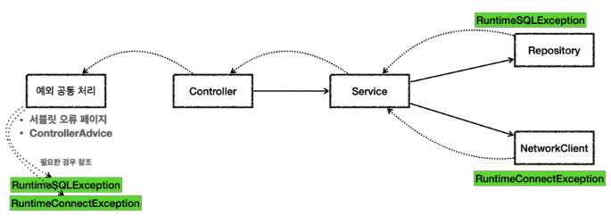
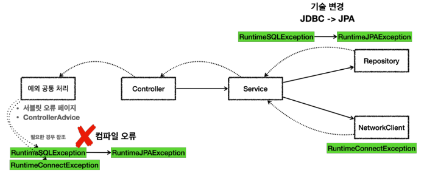

# 언체크 예외 활용



* ```SQLException``` 을 런타임 예외인 ```RuntimeSQLException``` 으로 변환했다.
* ```ConnectException``` 대신에 ```RuntimeConnectException``` 을 사용하도록 바꾸었다.
* 런타임 예외이기 때문에 서비스, 컨트롤러는 해당 예외들을 처리할 수 없다면 별도의 선언 없이 그냥 두면 된다.

```java
package thespeace.jdbc.exception.basic;

import org.junit.jupiter.api.Test;
import java.net.ConnectException;
import java.sql.SQLException;

import static org.assertj.core.api.Assertions.assertThatThrownBy;

@Slf4j
public class UncheckedAppTest {
  @Test
  void unchecked() {
    Controller controller = new Controller();
    assertThatThrownBy(() -> controller.request())
            .isInstanceOf(Exception.class);
  }

  @Test
  void printEx() {
    Controller controller = new Controller();
    try {
      controller.request();
    } catch (Exception e) {
      //e.printStackTrace();
      log.info("ex", e);
    }
  }

  static class Controller {
    Service service = new Service();

    public void request() {
      service.logic();
    }
  }

  static class Service {
    Repository repository = new Repository();
    NetworkClient networkClient = new NetworkClient();

    public void logic() {
      repository.call();
      networkClient.call();
    }
  }

  static class NetworkClient {
    public void call() {
      throw new RuntimeConnectException("연결 실패");
    }
  }

  static class Repository {
    public void call() {
      try {
        runSQL();
      } catch (SQLException e) {
        throw new RuntimeSQLException(e);
      }
    }

    private void runSQL() throws SQLException {
      throw new SQLException("ex");
    }
  }

  static class RuntimeConnectException extends RuntimeException {
    public RuntimeConnectException(String message) {
      super(message);
    }
  }

  static class RuntimeSQLException extends RuntimeException {
    public RuntimeSQLException() {
    }

    public RuntimeSQLException(Throwable cause) {
      super(cause);
    }
  }
}
```

<br>

### 예외 전환
* 리포지토리에서 체크 예외인 ```SQLException``` 이 발생하면 런타임 예외인 ```RuntimeSQLException``` 으로 전환해서 예외를 던진다.
  * 참고로 이때 기존 예외를 포함해주어야 예외 출력시 스택 트레이스에서 기존 예외도 함께 확인할 수 있다.
* ```NetworkClient``` 는 단순히 기존 체크 예외를 ```RuntimeConnectException``` 이라는 런타임 예외가 발생하도록 코드를 바꾸었다.

<br>

### 런타임 예외 - 대부분 복구 불가능한 예외
시스템에서 발생한 예외는 대부분 복구 불가능 예외이다. 런타임 예외를 사용하면 서비스나 컨트롤러가 이런 복구 불가능한 예외를 신경쓰지 않아도 된다.
물론 이렇게 복구 불가능한 예외는 일관성 있게 공통으로 처리해야 한다.

<br>

### 런타임 예외 - 의존 관계에 대한 문제
런타임 예외는 해당 객체가 처리할 수 없는 예외는 무시하면 된다. 따라서 체크 예외 처럼 예외를 강제로 의존하지 않아도 된다.

<br>

### 런타임 예외 throws 생략
```java
class Controller {
  public void request() {
    service.logic();
  }
}
class Service {
  public void logic() {
    repository.call();
    networkClient.call();
  }
}
```
런타임 예외이기 때문에 컨트롤러나 서비스가 예외를 처리할 수 없다면 다음 부분을 생략할 수 있다.
* ```method() throws RuntimeSQLException, RuntimeConnectException```
* 따라서 컨트롤러와 서비스에서 해당 예외에 대한 의존 관계가 발생하지 않는다.

<br>

### 런타임 예외 구현 기술 변경시 파급 효과


* 런타임 예외를 사용하면 중간에 기술이 변경되어도 해당 예외를 사용하지 않는 컨트롤러, 서비스에서는 코드를 변경하지 않아도 된다.
* 구현 기술이 변경되는 경우, 예외를 공통으로 처리하는 곳에서는 예외에 따른 다른 처리가 필요할 수 있다. 하지만 공통 처리하는 한곳만 변경하면 되기 때문에 변경의 영향 범위는 최소화 된다.

<br>

### 정리
처음 자바를 설계할 당시에는 체크 예외가 더 나은 선택이라 생각했다. 그래서 자바가 기본으로 제공하는 기능들에는 체크 예외가 많다.<br>
그런데 시간이 흐르면서 복구 할 수 없는 예외가 너무 많아졌다. 특히 라이브러리를 점점 더 많이 사용하면서 처리해야 하는 예외도 더 늘어났다.
체크 예외는 해당 라이브러리들이 제공하는 모든 예외를 처리할 수 없을 때마다 ```throws``` 에 예외를 덕지덕지 붙어야 했다.
그래서 개발자들은 ```throws Exception```이라는 극단적?인 방법도 자주 사용하게 되었다. 물론 이 방법은 사용하면 안된다.
모든 예외를 던진다고 선언하는 것인데, 결과적으로 어떤 예외를 잡고 어떤 예외를 던지는지 알 수 없기 때문이다. 체크 예외를 사용한다면 잡을 건 잡고 던질 예외는 명확하게 던지도록 선언해야 한다.<br>
체크 예외의 이런 문제점 때문에 최근 라이브러리들은 대부분 런타임 예외를 기본으로 제공한다. 사실 위에서 예시로 설명한 JPA 기술도 런타임 예외를 사용한다. 스프링도 대부분 런타임 예외를 제공한다.
런타임 예외도 필요하면 잡을 수 있기 때문에 필요한 경우에는 잡아서 처리하고, 그렇지 않으면 자연스럽게 던지도록 둔다. 그리고 예외를 공통으로 처리하는 부분을 앞에 만들어서 처리하면 된다.<br>
추가로 런타임 예외는 놓칠 수 있기 때문에 문서화가 중요하다.

<br>

### 런타임 예외는 문서화
* 런타임 예외는 문서화를 잘해야 한다.
* 또는 코드에 throws 런타임예외 을 남겨서 중요한 예외를 인지할 수 있게 해준다.

<br>

### JPA EntityManager
```java
/**
 * Make an instance managed and persistent.
 * @param entity entity instance
 * @throws EntityExistsException if the entity already exists.
 * @throws IllegalArgumentException if the instance is not an
 * entity
 * @throws TransactionRequiredException if there is no transaction when
 * invoked on a container-managed entity manager of that is of type
 * <code>PersistenceContextType.TRANSACTION</code>
 */
public void persist(Object entity);
```
* 예) 문서에 예외 명시

<br>

### 스프링 JdbcTemplate
```java
/**
 * Issue a single SQL execute, typically a DDL statement.
 * @param sql static SQL to execute
 * @throws DataAccessException if there is any problem
 */
void execute(String sql) throws DataAccessException;
```
* 예) ```method() throws DataAccessException``` 와 같이 문서화 + 코드에도 명시
  * 런타임 예외도 ```throws``` 에 선언할 수 있다. 물론 생략해도 된다.
  * 던지는 예외가 명확하고 중요하다면, 코드에 어떤 예외를 던지는지 명시되어 있기 때문에 개발자가 IDE를 통해서 예외를 확인하기가 편리하다.
  * 물론 컨트롤러나 서비스에서 ```DataAccessException``` 을 사용하지 않는다면 런타임 예외이기 때문에 무시해도 된다.